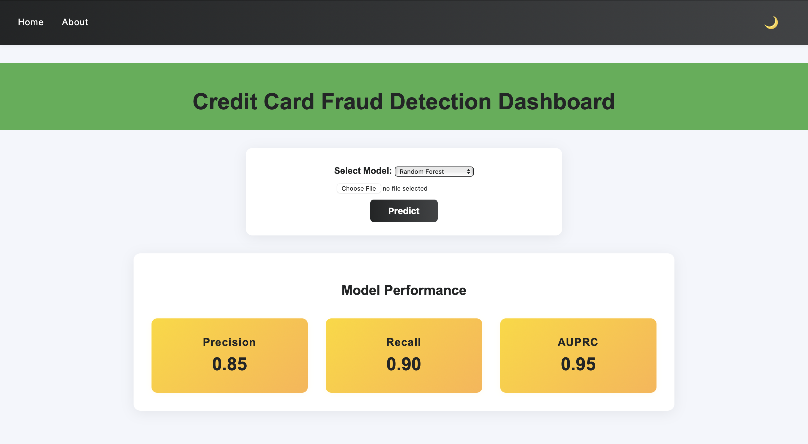

# Credit Card Fraud Detection Dashboard

This project is a web-based dashboard for detecting credit card fraud using machine learning models. It allows users to upload transaction data, select a prediction model, and visualize important dataset insights.

---

## Screenshot




---

## Features

- **Upload & Predict:** Upload `.xlsx` files with transaction data and get fraud predictions.
- **Model Selection:** Choose between Random Forest, Logistic Regression, and K-Nearest Neighbors models for prediction.
- **Visualizations:** Interactive carousel with heatmap, ROC curve, and class distribution plots.
- **Dark/Light Mode:** Toggle between dark and light themes for comfortable viewing.
- **Dataset Overview:** View a summary and the first 10 rows of the dataset.

## Project Structure

```
Credit Card Fraud Detection/
│
├── app.py                  # Flask backend
├── app.ipynb               # Jupyter notebook for data prep & model training
├── creditcard.csv          # Dataset (Git LFS tracked)
├── knn_model.pkl           # KNN model (Git LFS tracked)
├── logreg_model.pkl        # Logistic Regression model (Git LFS tracked)
├── random_forest_model.pkl # Random Forest model (Git LFS tracked)
├── scaler.pkl              # Scaler for Amount column
│
├── static/
│   ├── css/
│   │   └── styles.css      # Custom styles
│   └── images/
│       ├── heatmap.png
│       ├── roc_curve.png
│       └── class_distribution.png
│
├── templates/
│   ├── index.html          # Home/dashboard page
│   └── about.html          # About & visualizations page
│
├── screenshots/
│   └── app_screenshot.png  # <-- Place your screenshot here
│
└── .gitattributes          # Git LFS tracking for large files
```

## Setup Instructions

1. **Clone the repository:**
    ```bash
    git clone <your-repo-url>
    cd Credit\ Card\ Fraud\ Detection
    ```

2. **Install dependencies:**
    ```bash
    python3 -m venv .venv
    source .venv/bin/activate
    pip install -r requirements.txt
    ```

3. **Download LFS files:**
    ```bash
    git lfs pull
    ```

4. **Run the Flask app:**
    ```bash
    flask run
    ```
    The app will be available at [http://127.0.0.1:5000](http://127.0.0.1:5000).

5. **(Optional) Train models:**  
   Use `app.ipynb` to retrain models and regenerate `.pkl` files if needed.

## Usage

- **Home:** Upload your `.xlsx` file, select a model, and download predictions.
- **About:** Learn about the dataset and view interactive visualizations.
- **Theme Toggle:** Use the 🌙/☀️ button in the navbar to switch between dark and light modes.

## Requirements

- Python 3.8+
- Flask
- scikit-learn
- pandas
- imbalanced-learn
- matplotlib, seaborn
- joblib

## License

This project is for educational purposes.

---

**Credit:**  
Dataset from [Kaggle: Credit Card Fraud Detection](https://www.kaggle.com/mlg-ulb/creditcardfraud)
